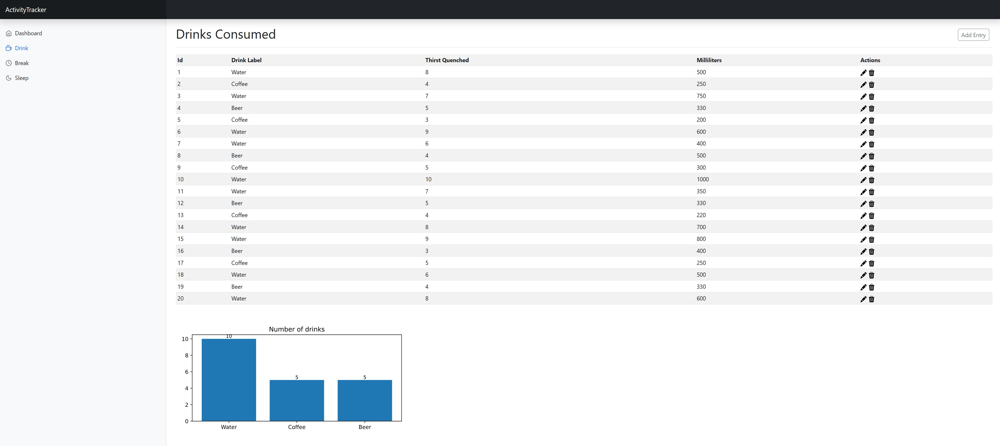

# ActivityTracker

ActivityTracker is a Django-based web application for tracking and visualizing daily activities such as breaks, drinks,
and sleep intervals. The project provides CRUD interfaces, statistics, and visualizations for each activity type.

---

## Features

- Track breaks, drinks, and sleep intervals with detailed attributes
- Visualize activity statistics with interactive charts (matplotlib)
- Responsive web interface using Bootstrap and Django generic views
- Modular structure for easy extension
- Dashboard overview and statistics

---

## Technologies & Libraries Used

- [Django](https://www.djangoproject.com/) – Web framework
- [Bootstrap 5](https://getbootstrap.com/) – Frontend styling
- [Matplotlib](https://matplotlib.org/) – Data visualization
- [SQLite](https://www.sqlite.org/) – Default database
- Python 3.13+

---

## Project Structure

- `breaktime/` – Models, views, and templates for breaks
- `drink/` – Models, views, and templates for drinks
- `sleeptime/` – Models, views, and templates for sleep intervals
- `dashboard/` – Main dashboard and overview
- `auxiliary/` – Helper modules (choices, context generators, view generators)
- `templates/` – Shared HTML templates
- `auxiliary/screenshot.png` – Example screenshot of the GUI

---

## Installation

1. Clone the repository:
   ```bash
   git clone https://github.com/Butterbananenbrot/ActivityTracker.git
   cd ActivityTracker
   ```
2. Create and activate virtual environment:
   ```bash
   python -m venv activity_tracker
    source activity_tracker/bin/activate
   ```
3. Install dependencies:
   ```bash
   pip install -r requirements.txt
   ```
4. Make/apply migrations:
   ```bash
   python manage.py makemigrations
   python manage.py migrate
   ```
5. Load demo data from json_files (optional):
   ```bash
   python manage.py loaddata json_files/input.json
   ```
6. Run the development server:
   ```bash
   python manage.py runserver
   ```
---


## Installation using Docker

1. Clone the repository:
   ```bash
   git clone https://github.com/Butterbananenbrot/ActivityTracker.git
   cd ActivityTracker
   ```
2. Create image and run container:
   ```bash
    docker build -t activity_tracker .
    docker run -p 8000:8000 activity_tracker
   ```

## Usage

- Access the dashboard at [http://localhost:8000/](http://localhost:8000/)
- Add, update, and delete activities via the web interface
- View statistics and visualizations on the dashboard

---

## Screenshot



---

## Testing

- Run tests with:
  ```bash
  python manage.py test
  ```

---

## Authors

- Butterbananenbrot
- Lezin901


